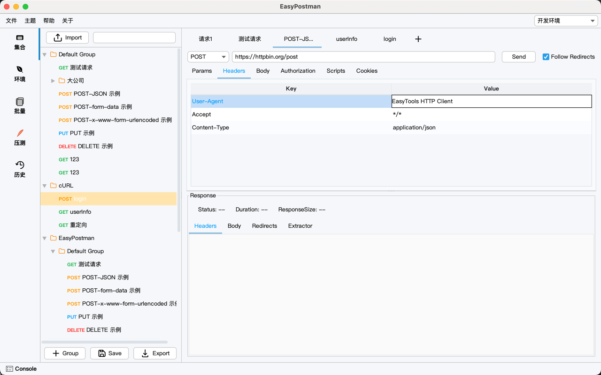
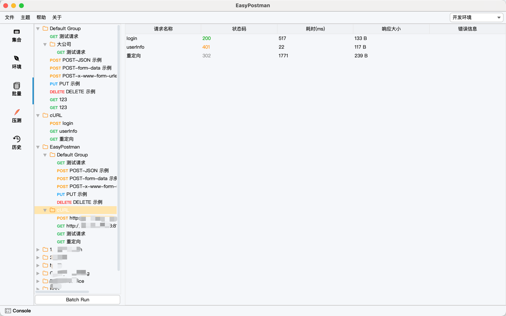
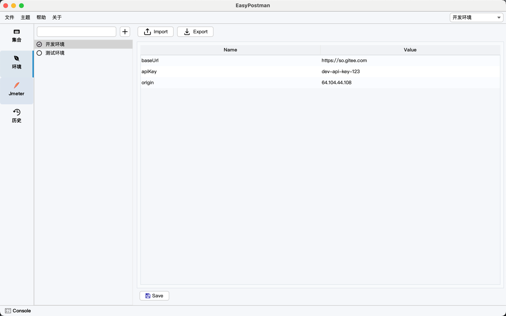
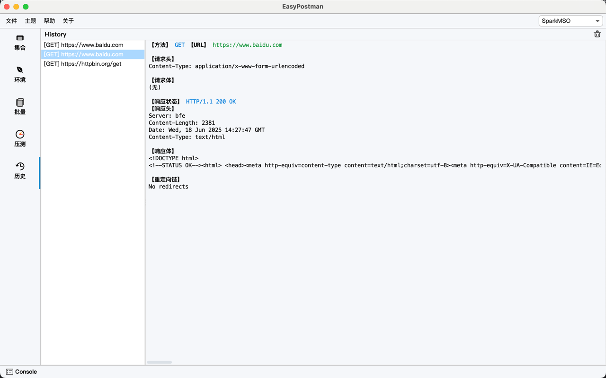
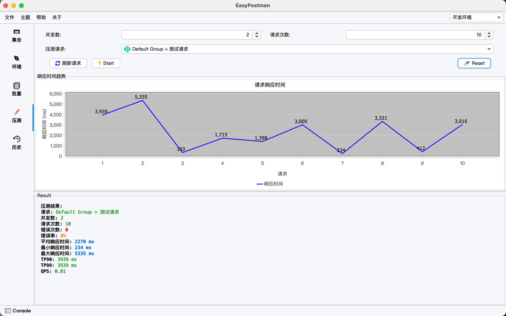

[English](README_EN.md) | 中文

# EasyPostman

> 🚀 一款高仿 Postman 的开源接口调试工具，专为开发者优化，界面简洁、功能强大。

EasyPostman 致力于为开发者提供媲美 Postman 的本地 API 调试体验，支持多环境变量、批量请求、压力测试等高级功能，助力高效测试和管理
API。

- GitHub: [https://github.com/lakernote/easy-postman](https://github.com/lakernote/easy-postman)
- Gitee: [https://gitee.com/lakernote/easy-postman](https://gitee.com/lakernote/easy-postman)
- 微信：lakernote

---

## 快速开始

1. 克隆仓库：`git clone https://gitee.com/lakernote/easy-postman.git`
2. 使用 JDK 17+ 编译运行：`mvn clean package`
3. 运行主程序：`App.java` 或 `java -jar target/easy-postman.jar`

或直接使用打包脚本（见下文“打包说明”）。

---

## 功能特性

- 🚦 支持常用 HTTP 方法（GET/POST/PUT/DELETE 等）
- 🌏 多环境变量管理，轻松切换测试环境
- 🕑 请求历史自动保存，便于回溯与复用
- 📦 批量请求与压力测试，满足多场景需求
- 📝 语法高亮请求编辑器
- 🌐 多语言支持（简体中文、英文，开发中）
- 💾 本地数据存储，隐私安全
- 🖥️ 现代化 UI 主题，支持深色模式

---

## 技术栈

- Java 17
- Swing 桌面 GUI
- jlink & jpackage 打包分发
- jIconFont-Swing 字体图标
- FlatLaf：现代化 UI 主题，支持暗色模式和高分辨率显示。
- RSyntaxTextArea：支持语法高亮的文本编辑器组件，适合代码编辑场景。
- AutoComplete：为输入框添加自动补全功能。
- SwingX：提供扩展的 Swing 组件，如 JXTable、JXTree、JXStatusBar 等。
- JGoodies Forms：灵活的布局管理器，简化复杂界面布局。
- MigLayout：强大的布局管理器，支持复杂界面设计。

---

## 截图预览

|          图标          |             集合管理              |          批量请求           |
|:--------------------:|:-----------------------------:|:-----------------------:|
|  |  |  |

|              环境变量              |           历史记录            |             压力测试             |
|:------------------------------:|:-------------------------:|:----------------------------:|
|  |  |  |

---

## 打包说明

- **Mac**：执行 `build/mac.sh`（需安装 JDK 17+）
- **Windows**：安装 [wix3](https://github.com/wixtoolset/wix3) 后执行 `build/win.bat`

---

## 社区与贡献

- 欢迎提交 Issue、PR 参与共建
- QQ 群/微信群（可在 Issue 区留言获取）
- 关注 [GitHub](https://github.com/lakernote/easy-postman) 获取最新动态

---

## 开源协议

本项目基于 [Apache-2.0](https://www.apache.org/licenses/LICENSE-2.0) 协议开源。
