[English](README_EN.md) | 中文

# EasyPostman

> 🚀 一款高仿 Postman + 简易版 JMeter 的开源接口调试与压测工具，专为开发者优化，界面简洁、功能强大。

EasyPostman 致力于为开发者提供媲美 Postman 的本地 API 调试体验，并集成简易版 JMeter
的批量请求与压力测试能力，支持多环境变量、批量请求、压力测试等高级功能，助力高效测试和管理 API。

- 🌟 GitHub: [https://github.com/lakernote/easy-postman](https://github.com/lakernote/easy-postman)
- 🏠 Gitee: [https://gitee.com/lakernote/easy-postman](https://gitee.com/lakernote/easy-postman)
- 📦 安装包下载地址: [https://gitee.com/lakernote/easy-postman/releases](https://gitee.com/lakernote/easy-postman/releases)
    - 🍏 Mac: EasyPostman-最新版本.dmg
    - 🪟 Windows: EasyPostman-最新版本.msi
- 💬 微信：**lakernote**

---

## ✨ 功能特性

- 🚦 支持常用 HTTP 方法（GET/POST/PUT/DELETE 等）
- 🌏 多环境变量管理，轻松切换测试环境
- 🕑 请求历史自动保存，便于回溯与复用
- 📦 批量请求与压力测试（简易版 JMeter），满足多场景需求，支持报告、结果树、趋势图可视化
- 📝 语法高亮请求编辑器
- 🌐 多语言支持（简体中文、英文，开发中）
- 💾 本地数据存储，隐私安全
- 📂 支持导入导出 Postman v2.1、curl格式
- 📊 响应结果可视化，支持 JSON/XML 格式
- 🔍 支持请求参数、头部、Cookie 等配置
- 📂 支持文件上传下载
- 📑 支持请求脚本（Pre-request Script、Tests）
- 🔗 支持请求链路（Chaining）

---

## 🖼️ 截图预览

| 预览 | 预览 |
|:----:|:----:|
|  |  |
| 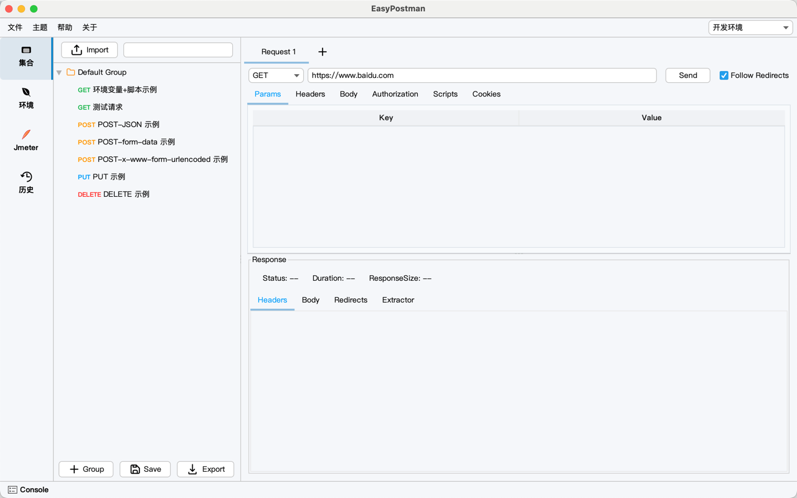 | 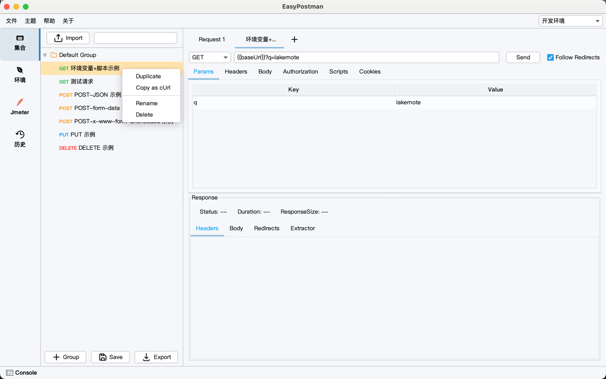 |
| 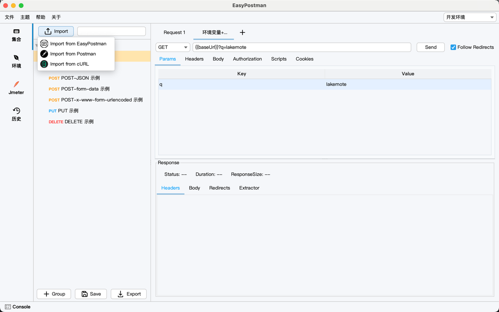 | 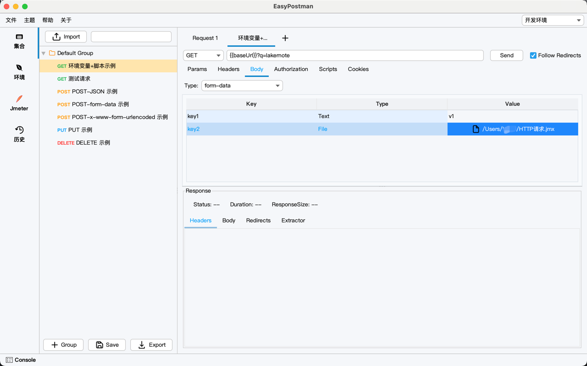 |
| 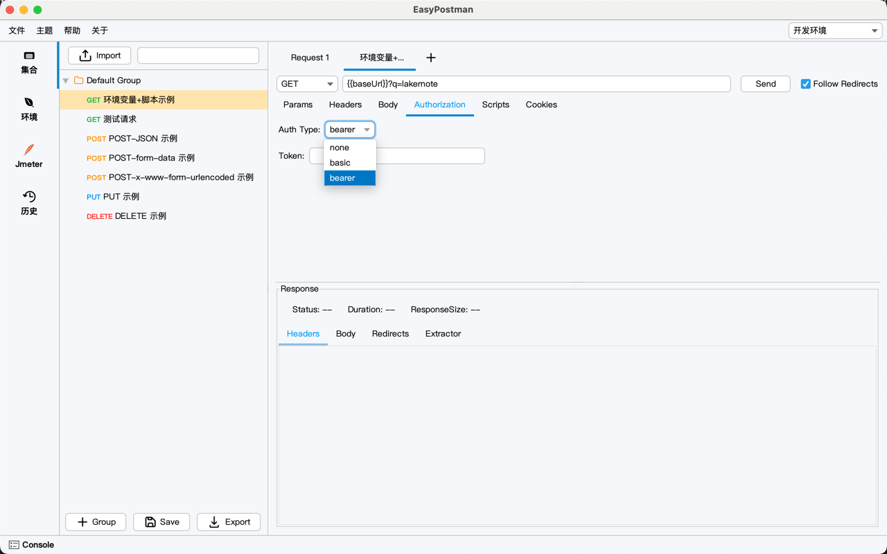 | 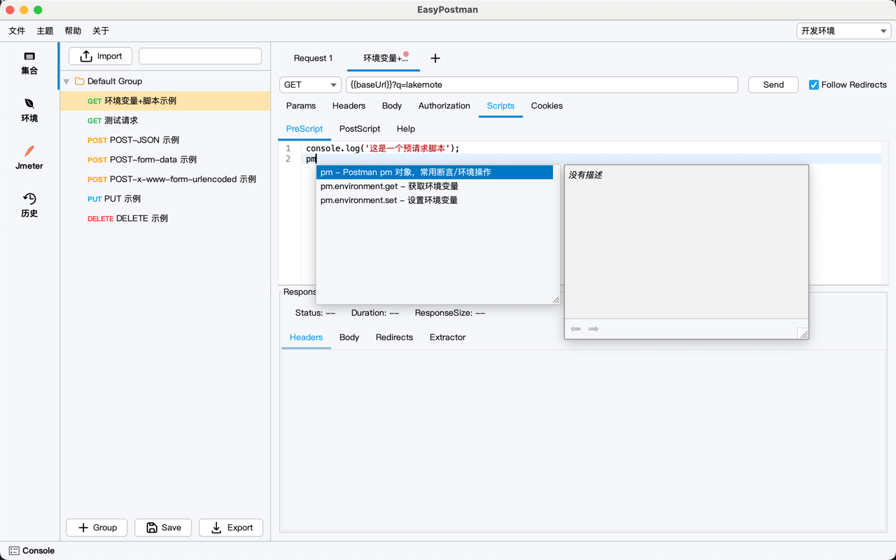 |
| 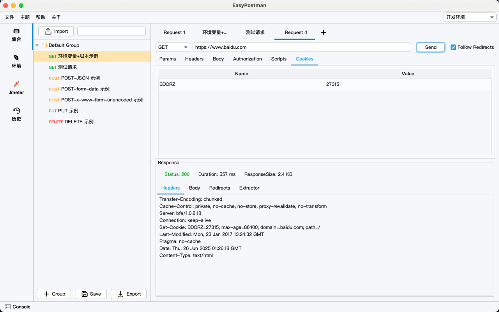 | 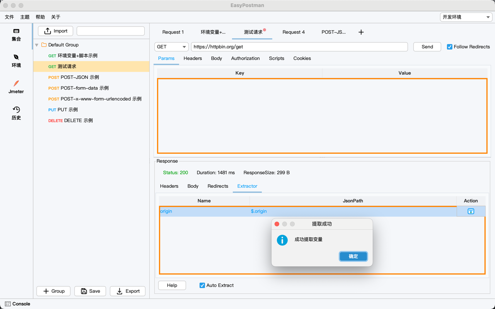 |
|  |  |
| 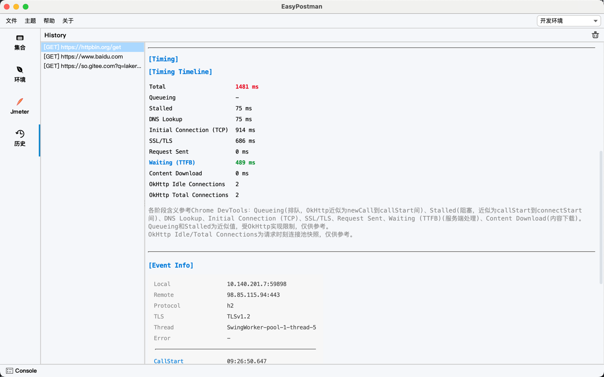 | 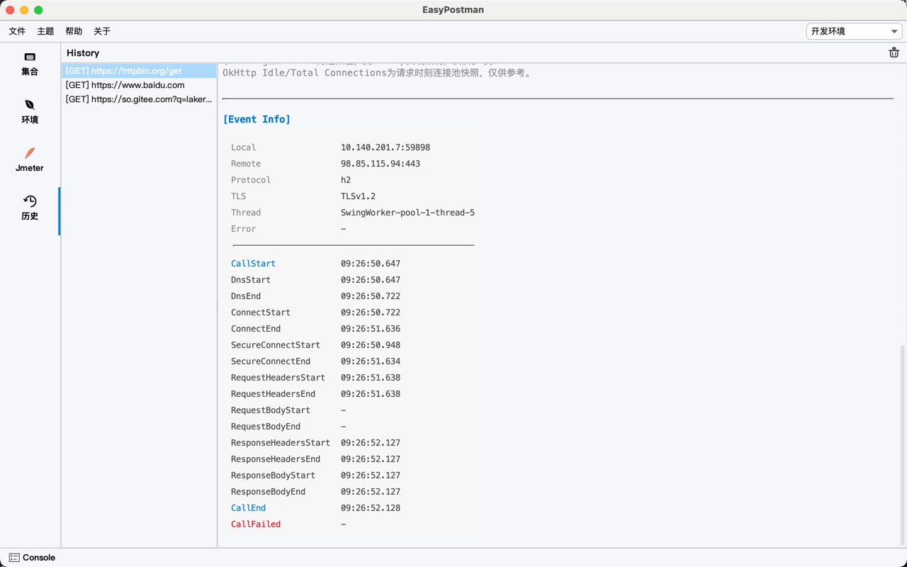 |
|  | 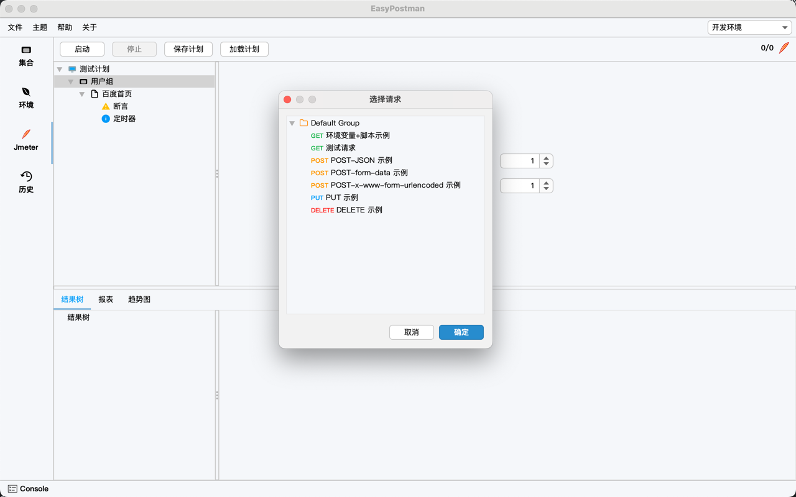 |
|  |  |
|  | 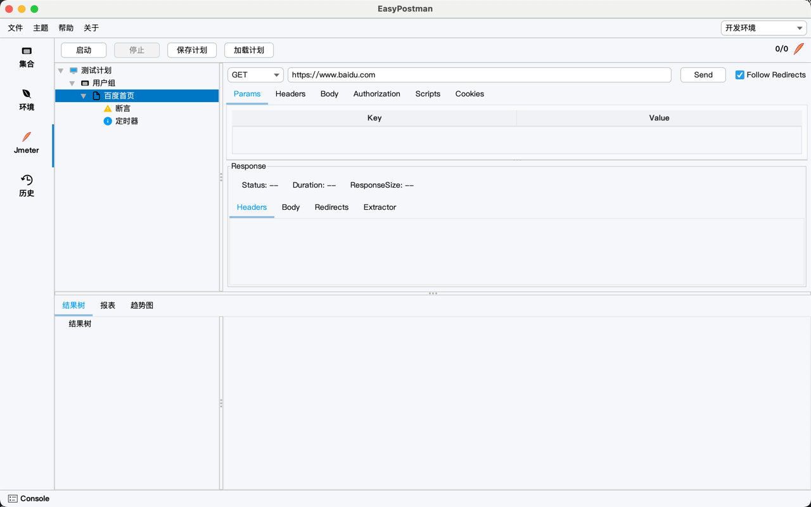 |

---

## 技术栈

- Java 17
- JavaSwing 桌面 GUI
- jlink & jpackage desktop 打包
- jIconFont-Swing 字体图标
- FlatLaf：现代化 UI 主题，支持暗色模式和高分辨率显示。
- RSyntaxTextArea：支持语法高亮的文本编辑器组件，适合代码编辑场景。
- AutoComplete：为输入框添加自动补全功能。
- SwingX：提供扩展的 Swing 组件，如 JXTable、JXTree、JXStatusBar 等。
- JGoodies Forms：灵活的布局管理器，简化复杂界面布局。
- MigLayout：强大的布局管理器，支持复杂界面设计。
- 加载优化，加载中提示，异步加载，懒加载等。

---

## 🚀 快速开始

1. ⬇️ 克隆仓库：`git clone https://gitee.com/lakernote/easy-postman.git`
2. 🛠️ 使用 JDK 17+ 编译运行：`mvn clean package`
3. ▶️ 运行主程序：`App.java` 或 `java -jar target/easy-postman.jar`

---

## 打包说明

> 打包 EasyPostman 需要 JDK 17+ 环境，使用 Maven 进行打包。

- **Mac**：执行 `build/mac.sh`
- **Windows**：安装 [wix3](https://github.com/wixtoolset/wix3) 后执行 `build/win.bat`

---

## 社区与贡献

- 欢迎提交 Issue、PR 参与共建
- QQ 群/微信群（可在 Issue 区留言获取）或添加微信 **lakernote** 交流
- 关注 [GitHub](https://github.com/lakernote/easy-postman) 获取最新动态

---

## 开源协议

本项目基于 [Apache-2.0](https://www.apache.org/licenses/LICENSE-2.0) 协议开源。
