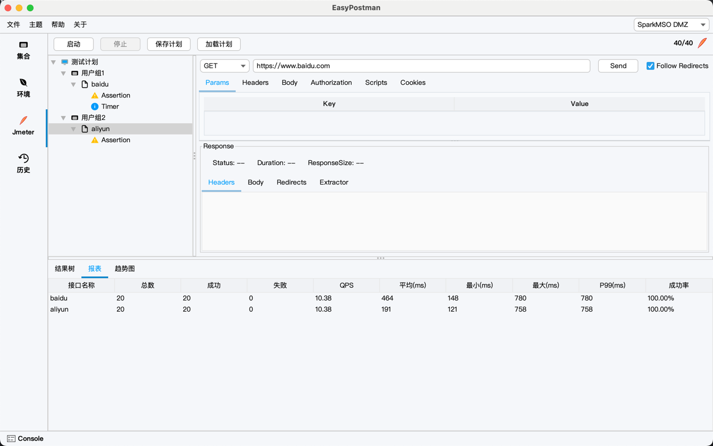
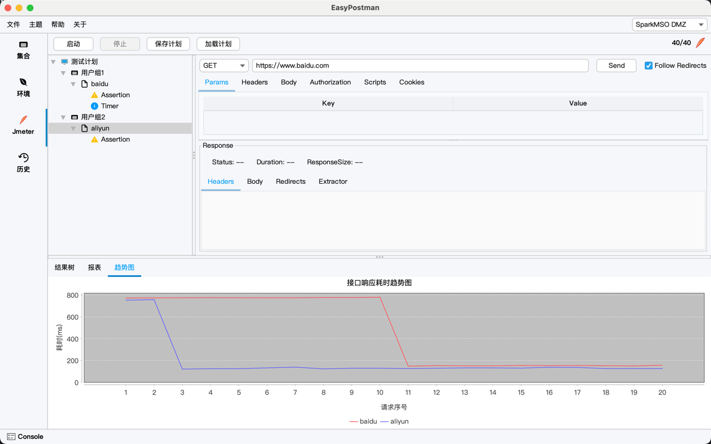

[中文](README.md) | English

# EasyPostman

> 🚀 An open-source API debugging and stress testing tool inspired by Postman and a simplified JMeter, optimized for
> developers with a clean UI and powerful features.

EasyPostman aims to provide developers with a local API debugging experience comparable to Postman, and integrates batch
requests and stress testing capabilities similar to a simplified JMeter. It supports advanced features such as
environment variables, batch requests, and stress testing to help efficiently test and manage APIs.

- 🌟 GitHub: [https://github.com/lakernote/easy-postman](https://github.com/lakernote/easy-postman)
- 🏠 Gitee: [https://gitee.com/lakernote/easy-postman](https://gitee.com/lakernote/easy-postman)
- 📦 Download: [https://gitee.com/lakernote/easy-postman/releases](https://gitee.com/lakernote/easy-postman/releases)
    - 🍏 Mac: EasyPostman-1.0.0.dmg
    - 🪟 Windows: EasyPostman-1.0.0.msi
- 💬 WeChat: **lakernote**

---

## ✨ Features

- 🚦 Supports common HTTP methods (GET/POST/PUT/DELETE, etc.)
- 🌏 Environment variable management for easy switching
- 🕑 Auto-saved request history for review and reuse
- 📦 Batch requests & stress testing (simplified JMeter), supports report, result tree, and trend chart visualization
- 📝 Syntax highlighting request editor
- 🌐 Multi-language support (Simplified Chinese, English, in development)
- 💾 Local data storage for privacy and security
- 📂 Import/Export Postman v2.1, curl format
- 📊 Visualized response results, supports JSON/XML
- 🔍 Configurable request parameters, headers, cookies, etc.
- 📂 File upload and download support
- 📑 Request scripts (Pre-request Script, Tests)
- 🔗 Request chaining support

---

## 🖼️ Screenshots

|      Welcome      | Collection Management |   Environments   |
|:----------------:|:--------------------:|:----------------:|
|  |  |  |

|   History   |   JMeter Report   |  JMeter Result Tree  |
|:-----------:|:-----------------:|:--------------------:|
|  |  |  |

|  JMeter Trend  |   Icon   |
|:--------------:|:--------:|
|  |  |

---

## 🚀 Quick Start

1. ⬇️ Clone the repo: `git clone https://gitee.com/lakernote/easy-postman.git`
2. 🛠️ Build with JDK 17+: `mvn clean package`
3. ▶️ Run the app: `App.java` or `java -jar target/easy-postman.jar`

---

## Packaging

> Packaging EasyPostman requires JDK 17+ and uses Maven.

- **Mac**: Run `build/mac.sh`
- **Windows**: Install [wix3](https://github.com/wixtoolset/wix3) then run `build/win.bat`

---

## Community & Contribution

- Issues and PRs are welcome!
- QQ/WeChat groups (ask in Issues for details) or add WeChat **lakernote**
- Follow [GitHub](https://github.com/lakernote/easy-postman) for updates

---

## License

This project is open-sourced under the [Apache-2.0](https://www.apache.org/licenses/LICENSE-2.0) license.
