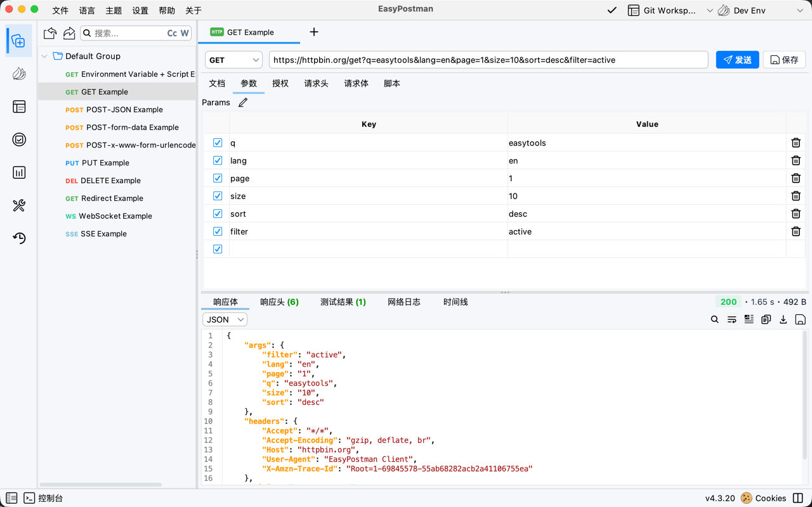

<div align="center">

[English](README.md) | 简体中文

</div>

# EasyPostman

> 🚀 一款高仿 Postman + 简易版 JMeter 的开源接口调试与压测工具，专为开发者优化，界面简洁、功能强大，内置 Git 集成，支持团队协作与版本控制。


---

## 📖 目录

- [✨ 功能特性](#-功能特性)
- [📦 下载](#-下载)
- [🚀 快速开始](#-快速开始)
- [🖼️ 截图预览](#️-截图预览)
- [🤝 贡献指南](#-贡献指南)
- [📚 文档](#-文档)
- [❓ 常见问题](#-常见问题)
- [💖 支持项目](#-支持项目)

---

## 💡 项目简介

EasyPostman 为开发者提供**本地化、隐私优先**的 API 调试体验，媲美 Postman，同时集成简易版 JMeter 的性能测试能力。采用 Java Swing 构建，支持跨平台运行，完全离线可用，内置 Git 工作区功能，支持团队协作和版本控制。

### 🔥 开发理念

- **🎯 专注核心功能** - 简洁而不简单，功能丰富而不臃肿
- **🔒 隐私优先** - 100% 本地存储，数据不上云，保护开发者隐私
- **🚀 性能至上** - 原生 Java 应用，启动快速，运行流畅


---

## ✨ 功能特性

### 🏢 工作区 & 协作
- **本地工作区** - 个人项目，数据本地存储
- **Git 工作区** - 版本控制和团队协作
- **多设备同步** - 通过 Git 仓库共享接口数据
- **项目隔离** - 每个工作区独立管理集合和环境

### 🔌 接口测试
- **HTTP/HTTPS** - 完整的 REST API 支持（GET、POST、PUT、DELETE 等）
- **WebSocket & SSE** - 实时协议支持
- **多种请求体** - Form Data、JSON、XML、Binary
- **文件上传下载** - 支持拖拽
- **环境变量** - 多环境管理，支持动态变量

### ⚡ 性能测试
- **线程组模式** - 固定、递增、阶梯、尖刺
- **实时监控** - TPS、响应时间、错误率
- **可视化报告** - 性能趋势图和结果树
- **批量请求** - 简易版 JMeter 风格测试

### 📝 高级功能
- **请求前脚本** - 请求前执行 JavaScript
- **测试脚本** - 断言和响应验证
- **请求链路** - 提取数据传递给下一个请求
- **网络事件日志** - 详细的请求/响应分析
- **导入导出** - Postman v2.1、cURL、HAR（进行中）

### 🎨 用户体验
- **亮色暗色模式** - 任何光线下舒适观看
- **多语言** - 中文、English
- **语法高亮** - JSON、XML、JavaScript
- **跨平台** - Windows、macOS、Linux

📖 **[查看所有功能 →](docs/FEATURES_zh.md)**

---

## 📦 下载

### 最新版本

🔗 **[GitHub Releases](https://github.com/lakernote/easy-postman/releases)** | **[Gitee 镜像（国内）](https://gitee.com/lakernote/easy-postman/releases)**

### 平台下载

| 平台 | 下载 | 说明 |
|------|------|------|
| 🍎 **macOS (Apple Silicon)** | `EasyPostman-{版本号}-macos-arm64.dmg` | 适用于 M1/M2/M3/M4 Mac |
| 🍏 **macOS (Intel)** | `EasyPostman-{版本号}-macos-x86_64.dmg` | 适用于 Intel Mac |
| 🪟 **Windows (安装版)** | `EasyPostman-{版本号}-windows-x64.exe` | 安装程序，支持自动更新 |
| 🪟 **Windows (便携版)** | `EasyPostman-{版本号}-windows-x64-portable.zip` | 解压即用，无需安装 |
| 🐧 **Ubuntu/Debian** | `easypostman_{版本号}_amd64.deb` | DEB 安装包 |
| ☕ **跨平台** | `easy-postman-{版本号}.jar` | 需要 Java 17+ |

> ⚠️ **首次运行提示**
> 
> - **Windows**: 如遇 SmartScreen 警告 → 点击"更多信息" → "仍要运行"
> - **macOS**: 如提示"无法打开" → 右键点击应用 → 选择"打开" → 点击"打开"
> 
> 本应用完全开源，代码可审查。这些警告是因为我们没有购买代码签名证书。

### Gitee 国内镜像 🌏

由于存储空间限制，Gitee 镜像仅提供：
- macOS (Apple Silicon) DMG
- Windows 安装版和便携版 ZIP

其他平台请访问 GitHub Releases 下载。

---

## 🚀 快速开始

### 方式一：下载预编译版本

1. 从 [Releases](https://github.com/lakernote/easy-postman/releases) 下载适合您平台的安装包
2. 安装并运行：
   - **macOS**: 打开 DMG，拖拽到应用程序
   - **Windows 安装版**: 运行 EXE，按安装向导操作
   - **Windows 便携版**: 解压 ZIP，运行 `EasyPostman.exe`
   - **Linux DEB**: `sudo dpkg -i easypostman_{版本号}_amd64.deb`
   - **JAR**: `java -jar easy-postman-{版本号}.jar`

### 方式二：从源码构建

```bash
# 克隆仓库
git clone https://github.com/lakernote/easy-postman.git
cd easy-postman

# 构建并运行
mvn clean package
java -jar target/easy-postman-*.jar
```

📖 **[构建指南 →](docs/BUILD_zh.md)**

### 第一步

1. **创建工作区** - 选择本地（个人）或 Git（团队协作）
2. **创建集合** - 组织您的 API 请求
3. **发送第一个请求** - 输入 URL，配置参数，点击发送
4. **设置环境** - 轻松切换开发/测试/生产环境

---

## 🖼️ 截图预览

<div align="center">

### 主界面


### 工作区管理


### 接口集合 & API 测试


### 性能测试


</div>

📸 **[查看所有截图 →](docs/SCREENSHOTS_zh.md)**
---

## 🤝 贡献指南

我们欢迎任何形式的贡献！无论是 Bug 报告、功能建议还是代码贡献。

### 贡献方式

- 🐛 **报告 Bug** - 使用我们的 [Bug 报告模板](https://github.com/lakernote/easy-postman/issues/new/choose)
- ✨ **功能建议** - 通过 [功能请求](https://github.com/lakernote/easy-postman/issues/new/choose) 分享您的想法
- 💻 **提交代码** - Fork、编写代码并创建 Pull Request
- 📝 **改进文档** - 修正错别字、添加示例、翻译文档

### 自动化检查

当您提交 PR 时，会自动进行：
- ✅ 构建和编译检查
- ✅ 测试执行
- ✅ 代码质量验证
- ✅ PR 格式校验

📖 **[贡献指南 →](.github/CONTRIBUTING.md)**

---

## 📚 文档

- 📖 **[功能详细说明](docs/FEATURES_zh.md)** - 全面的功能文档
- 🏗️ **[系统架构](docs/ARCHITECTURE_zh.md)** - 技术栈和架构
- 🚀 **[构建指南](docs/BUILD_zh.md)** - 从源码构建和生成安装包
- 🖼️ **[截图展示](docs/SCREENSHOTS_zh.md)** - 所有应用截图
- 📝 **[脚本 API 参考](docs/SCRIPT_API_REFERENCE_zh.md)** - 请求前和测试脚本 API
- 📝 **[脚本代码片段速查](docs/SCRIPT_SNIPPETS_QUICK_REFERENCE.md)** - 内置代码片段
- 🔐 **[客户端证书](docs/CLIENT_CERTIFICATES.md)** - mTLS 配置
- 🐧 **[Linux 构建指南](docs/LINUX_BUILD.md)** - 在 Linux 上构建
- ❓ **[常见问题](docs/FQA.MD)** - 常见问题解答

---

## ❓ 常见问题

<details>
<summary><b>Q: 为什么选择本地存储而不是云同步？</b></summary>

A: 我们重视开发者的隐私安全。本地存储可以确保您的接口数据不会泄露给第三方。您可以选择使用 Git 工作区进行团队协作，同时保持对数据的完全控制。
</details>

<details>
<summary><b>Q: 如何导入 Postman 数据？</b></summary>

A: 在 Collections 界面点击 **导入** 按钮，选择 Postman v2.1 格式的 JSON 文件即可。工具会自动转换集合、请求和环境变量。
</details>

<details>
<summary><b>Q: 为什么 Windows/macOS 提示安全警告？</b></summary>

**Windows SmartScreen**: 未购买代码签名证书（约 $100-400/年）会触发警告。
- **解决方法**：点击"更多信息" → "仍要运行"
- 随着下载量增加，警告会逐渐减少

**macOS Gatekeeper**: 未购买 Apple 开发者证书（$99/年）+ 公证会触发警告。
- **解决方法**：右键点击应用 → 选择"打开"
- 或终端执行：`sudo xattr -rd com.apple.quarantine /Applications/EasyPostman.app`

本项目**完全开源**，代码可在 GitHub 审查。
</details>

<details>
<summary><b>Q: 支持团队协作吗？</b></summary>

A: ✅ **支持！** 使用 **Git 工作区**可以：
- 与团队共享接口集合和环境变量
- 使用版本控制跟踪变更（commit、push、pull）
- 跨多个设备工作
- 无需云服务即可协作
</details>

<details>
<summary><b>Q: 工作区之间的数据会相互影响吗？</b></summary>

A: 不会。每个工作区都是完全独立的，拥有自己的接口集合、环境变量和历史记录。切换工作区时数据完全隔离。
</details>

<details>
<summary><b>Q: Git 工作区支持哪些平台？</b></summary>

A: 支持所有标准的 Git 平台，包括：
- GitHub
- Gitee
- GitLab
- Bitbucket
- 自建 Git 服务器

只需提供标准的 Git URL（HTTPS 或 SSH）即可。
</details>

---

## 💖 支持项目

如果 EasyPostman 对您有帮助：

- ⭐ **给项目点个 Star** - 表达您的支持！
- 🍴 **Fork 并贡献** - 帮助改进项目
- 📢 **向朋友推荐** - 传播好工具
- 💬 **加入微信群** - 添加 **lakernote** 直接交流
- 💬 **GitHub 讨论区** - [提问和分享想法](https://github.com/lakernote/easy-postman/discussions)

---

## 🔗 相关链接

- 🌟 **GitHub**: [https://github.com/lakernote/easy-postman](https://github.com/lakernote/easy-postman)
- 🏠 **Gitee**: [https://gitee.com/lakernote/easy-postman](https://gitee.com/lakernote/easy-postman)
- 💬 **讨论区**: [https://github.com/lakernote/easy-postman/discussions](https://github.com/lakernote/easy-postman/discussions)
- 📦 **下载地址**: [https://github.com/lakernote/easy-postman/releases](https://github.com/lakernote/easy-postman/releases)

---

## ⭐ Star History

[](https://www.star-history.com/#lakernote/easy-postman&type=date&legend=top-left)

---

## 🙏 致谢

感谢以下优秀的开源项目：

- [FlatLaf](https://github.com/JFormDesigner/FlatLaf) - 现代化 Swing 主题
- [RSyntaxTextArea](https://github.com/bobbylight/RSyntaxTextArea) - 语法高亮编辑器
- [OkHttp](https://github.com/square/okhttp) - HTTP 客户端
- [Termora](https://github.com/TermoraDev/termora) - 优秀的终端模拟器

---

<div align="center">

**让 API 调试更简单，让性能测试更直观**

Made with ❤️ by [laker](https://github.com/lakernote)

</div>
