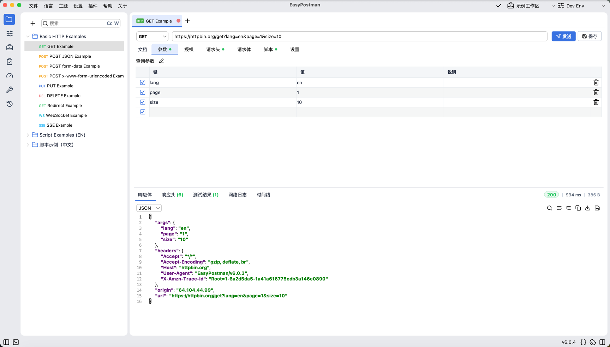
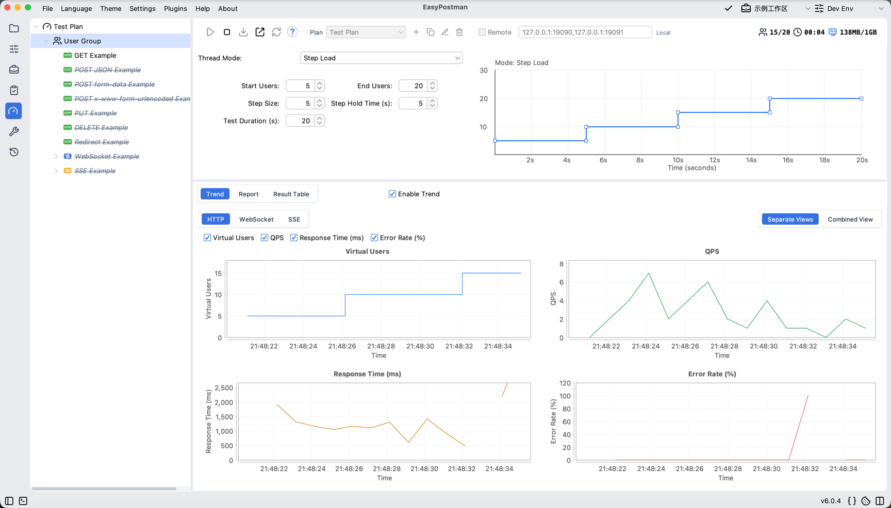
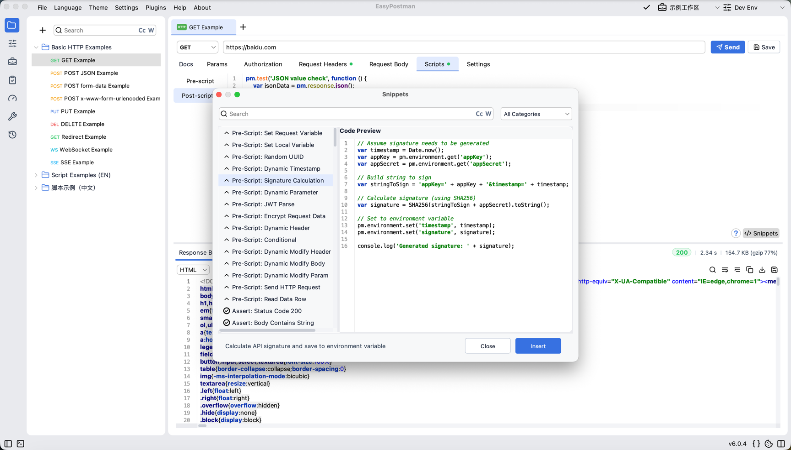
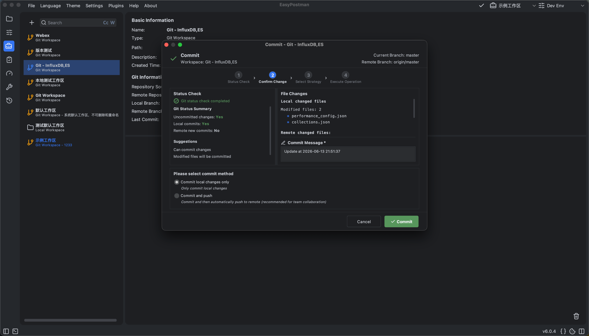

<div align="center">


# EasyPostman

**开源 Postman 风格接口调试 + JMeter 风格性能测试桌面工具**<br>
*高仿 Postman 交互体验 · JMeter 风格压测能力 · Java 桌面端 · 本地优先*

[](https://github.com/lakernote/easy-postman/blob/main/LICENSE)
[](https://github.com/lakernote/easy-postman/releases)
[](https://github.com/lakernote/easy-postman/releases)
[](https://github.com/lakernote/easy-postman/stargazers)
[](https://openjdk.org/)
[](https://github.com/lakernote/easy-postman/releases)

[](https://github.com/lakernote)
[](https://gitee.com/lakernote)

[English](README.md) · [简体中文](README_zh.md) · [📦 下载](https://github.com/lakernote/easy-postman/releases) · [📖 文档](docs/FEATURES_zh.md) · [💬 讨论区](https://github.com/lakernote/easy-postman/discussions) · 微信：`lakernote`

</div>

---

## 📖 目录

- [💡 项目简介](#-项目简介)
- [🖼️ 视觉导览](#️-视觉导览)
- [🧭 典型使用场景](#-典型使用场景)
- [✨ 功能特性](#-功能特性)
- [📦 下载](#-下载)
- [🚀 快速开始](#-快速开始)
- [🧪 集合 CLI](#-集合-cli)
- [🛠️ 开发指南](#️-开发指南)
- [🤝 贡献指南](#-贡献指南)
- [📚 文档](#-文档)
- [❓ 常见问题](#-常见问题)
- [💖 支持项目](#-支持项目)

---

## 💡 项目简介

EasyPostman 的核心亮点是把**高仿 Postman 的接口调试体验**和**JMeter 风格性能测试能力**放到一个本地优先的桌面应用里。项目基于 Java 17、Swing 和 FlatLaf 构建，默认把数据保存在本地；当团队需要同步、评审和版本控制时，可以通过 Git 工作区协作，不依赖托管云服务。

| 🎯 高仿 Postman 调试 | ⚡ JMeter 风格压测 | 🔒 本地优先桌面端 |
|:---:|:---:|:---:|
| 集合、环境、认证、脚本、导入、历史和响应查看 | 线程组、定时器、提取器、断言、实时指标、报告和分布式执行 | 除非主动选择 Git 工作区，否则接口和测试数据只保存在本机 |

---

## 🖼️ 视觉导览

EasyPostman 是 GUI 优先的桌面工具，项目价值要同时展示两条主线：高仿 Postman 的接口调试，以及 JMeter 风格的压测编排。下面截图均来自当前桌面应用。

<table>
  <tr>
    <th width="50%">Postman 风格接口调试</th>
    <th width="50%">JMeter 风格性能测试</th>
  </tr>
  <tr>
    <td width="50%"><a href="docs/collections.png"></a></td>
    <td width="50%"><a href="docs/performance-trend.png"></a></td>
  </tr>
  <tr>
    <th width="50%">脚本、断言 & 代码片段</th>
    <th width="50%">Git 工作区协作</th>
  </tr>
  <tr>
    <td width="50%"><a href="docs/script-snippets.png"></a></td>
    <td width="50%"><a href="docs/workspaces-gitcommit.png"></a></td>
  </tr>
</table>

📸 **[查看完整截图集 →](docs/SCREENSHOTS_zh.md)**

---

## 🧭 典型使用场景

| 场景 | 实际使用方式 |
|------|--------------|
| **像 Postman 一样调试 REST API** | 创建或导入集合，选择环境，发送请求，查看格式化响应体、headers、cookies、耗时和网络事件日志。 |
| **用脚本串联请求** | 使用请求前脚本和测试脚本读取变量、生成签名、提取响应数据、执行断言，并把值传给后续请求。 |
| **通过 Git 协作接口资产** | 工作区数据保存在本地，通过 Git 工作区提交、拉取、推送和审查集合/环境变更。 |
| **在 CI 中运行 Postman Collection** | 下载跨平台 JAR 或从源码构建，使用集合 CLI 执行环境变量、CSV/JSON 数据、脚本、断言和文件上传。 |
| **像 JMeter 一样编排压测** | 在界面中编排压测计划，导出 `plan.json`，再用无头 CLI 或 master/worker 模式执行，同时保持全局用户和 CSV 分片规则。 |

---

## ✨ 功能特性

### 🏢 工作区 & 协作
- **本地工作区** - 个人 API 项目完全保存在本机磁盘
- **Git 工作区** - 通过自己的 Git 仓库提交、拉取、推送和共享集合/环境
- **工作区隔离** - 每个工作区独立保存集合、环境、设置和历史记录
- **便携模式** - 通过 `.portable` 标记或系统属性让数据跟随应用目录

### 🔌 Postman 风格接口测试
- **HTTP/HTTPS** - 支持 headers、params、cookies、auth、redirects 和请求体编辑的 REST 调试
- **SSE & WebSocket** - 支持流式响应和实时协议场景
- **多种请求体** - Form Data、x-www-form-urlencoded、JSON、XML、文本和二进制
- **变量体系** - 支持环境、全局、请求和迭代数据，让请求和压测可重复执行
- **导入导出** - 支持 Postman v2.1、cURL，HAR 和 OpenAPI/Swagger 路径持续完善中
- **集合无头运行** - 使用跨平台 JAR 执行 Postman Collection，支持环境、数据文件、脚本、断言、文件上传和 CI 退出码

### ⚡ JMeter 风格性能测试
- **GUI 场景编排** - 线程组、定时器、提取器、断言和结果视图
- **线程组模式** - 固定、递增、阶梯、尖刺
- **实时监控** - TPS/QPS、响应时间、错误率、趋势图和结果树
- **无头与分布式压测** - GUI 导出 `plan.json` 后，可在服务器上用 CLI 或 master/worker 模式执行
- **总并发分片** - GUI 虚拟用户数就是全局总并发，workers 按连续区间分摊，CSV 行也跟随同一区间避免重复读取

### 🧩 脚本、断言 & 插件
- **请求前和测试脚本** - Postman 风格 `pm` API、断言、变量和请求链路
- **内置 JS 辅助库** - `crypto-js`、`lodash`、`moment`
- **脚本扩展点** - 插件可注册脚本 API、补全、代码片段、工具箱面板和服务
- **官方插件** - 插件管理、客户端证书、抓包代理、Redis、Kafka、Java 反编译
- **网络事件日志** - 详细的请求/响应和流式协议诊断

### 🎨 用户体验
- **亮色暗色模式** - 任何光线下舒适观看
- **多语言** - 中文、English
- **语法高亮** - JSON、XML、JavaScript
- **跨平台** - Windows、macOS、Linux

📖 **[查看所有功能 →](docs/FEATURES_zh.md)**

---

## 📦 下载

### 最新版本

🔗 **[GitHub Releases](https://github.com/lakernote/easy-postman/releases)** | **[Gitee 镜像（国内）](https://gitee.com/lakernote/easy-postman/releases)**

### 平台下载

| 平台 | 安装包 | 说明 |
|------|--------|------|
| 🍎 **macOS (Apple Silicon)** | `EasyPostman-{版本号}-macos-arm64.dmg` | M1/M2/M3/M4 |
| 🍏 **macOS (Intel)** | `EasyPostman-{版本号}-macos-x86_64.dmg` | Intel Mac |
| 🪟 **Windows (安装版)** | `EasyPostman-{版本号}-windows-x64.exe` | 支持自动更新 |
| 🪟 **Windows (便携版)** | `EasyPostman-{版本号}-windows-x64-portable.zip` | 解压即用 |
| 🐧 **Linux AMD64（通用）** | `EasyPostman-{版本号}-linux-amd64.deb` | 适用于常见 `x86_64` / `amd64` Linux 系统 |
| 🐧 **Linux ARM64（通用）** | `EasyPostman-{版本号}-linux-arm64.deb` | 适用于常见 `aarch64` / `arm64` Linux 系统 |
| 🐧 **Linux ARM64（兼容版）** | `EasyPostman-{版本号}-linux-arm64-compat.deb` | 与通用 ARM64 包内容相同，仅为旧版 Debian / Ubuntu `dpkg` 环境重打包 |
| 🐧 **RHEL / Rocky / CentOS / Fedora（x64）** | `EasyPostman-{版本号}-1.x86_64.rpm` | 仅 GitHub Releases 提供 |
| 🐧 **RHEL / Rocky / CentOS / Fedora（ARM64）** | `EasyPostman-{版本号}-1.aarch64.rpm` | 仅 GitHub Releases 提供 |
| ☕ **跨平台 JAR** | `easy-postman-{版本号}.jar` | 需要 Java 17+ |

> 🐧 **ARM64 兼容版 DEB 的作用**
>
> 兼容版和 `linux-arm64.deb` 包含同一个 EasyPostman 应用和同一套运行时，不是功能增强版，也不是旧版本。它只是把 DEB 包内部成员改为 xz 压缩格式，方便旧版 `dpkg` 安装；这些旧环境可能无法识别 `control.tar.zst` 或 `data.tar.zst` 等较新的压缩格式。正常情况下优先下载 `linux-arm64.deb`，只有当通用包因为 DEB 压缩格式兼容问题安装失败时，再改用 `linux-arm64-compat.deb`。

> ⚠️ **首次运行提示**
>
> - **Windows**：SmartScreen 警告 → "更多信息" → "仍要运行"
> - **macOS**：提示"无法打开" → 右键 → "打开" → "打开"
>
> 本应用完全开源，这些警告是因为未购买代码签名证书。

> 🌏 **Gitee 镜像** 仅提供 macOS（ARM）DMG 和 Windows 包。Linux 的 DEB / RPM 安装包仅发布在 GitHub Releases。

---

## 🚀 快速开始

### 方式一：下载预编译版本

1. 从 [Releases](https://github.com/lakernote/easy-postman/releases) 下载适合您平台的安装包
2. 安装并运行：

| 平台 | 操作 |
|------|------|
| macOS | 打开 DMG → 拖拽到应用程序 |
| Windows 安装版 | 运行 `.exe`，按向导操作 |
| Windows 便携版 | 解压 ZIP → 运行 `EasyPostman.exe` |
| Linux DEB（AMD64 通用） | `sudo dpkg -i EasyPostman-{版本号}-linux-amd64.deb` |
| Linux DEB（ARM64 通用） | `sudo dpkg -i EasyPostman-{版本号}-linux-arm64.deb` |
| Linux DEB（ARM64 兼容版） | `sudo dpkg -i EasyPostman-{版本号}-linux-arm64-compat.deb` |
| Linux RPM（x64） | `sudo rpm -ivh EasyPostman-{版本号}-1.x86_64.rpm` |
| Linux RPM（ARM64） | `sudo rpm -ivh EasyPostman-{版本号}-1.aarch64.rpm` |
| JAR | `java -jar easy-postman-{版本号}.jar` |

如果不确定该下载哪个 Linux 安装包，先执行 `uname -m`：

- `x86_64` -> 选择 `EasyPostman-{版本号}-linux-amd64.deb` 或 `x86_64.rpm`
- `aarch64` -> 选择 `EasyPostman-{版本号}-linux-arm64.deb`
- 如果安装通用 ARM64 包时，`dpkg` 提示不支持某种归档压缩格式 -> 改用 `EasyPostman-{版本号}-linux-arm64-compat.deb`

### 方式二：从源码构建

```bash
git clone https://github.com/lakernote/easy-postman.git
cd easy-postman
mvn -pl easy-postman-app -am -DskipTests clean package
java -jar easy-postman-app/target/easy-postman-*.jar
```

📖 **[构建指南 →](docs/BUILD_zh.md)**<br>
🔌 **[插件架构与安装 →](docs/PLUGINS_zh.md)**

### 第一步

1. **创建工作区** — 本地（个人）或 Git（团队协作）
2. **创建集合** — 组织您的 API 请求
3. **发送第一个请求** — 输入 URL，配置参数，点击发送
4. **设置环境** — 轻松切换开发 / 测试 / 生产环境

---

## 🧪 集合 CLI

无需安装 Node.js 或 Newman，直接使用 EasyPostman JAR 无头运行 Postman Collection v2.1。

### 第一步：获取 JAR

任选一种方式：

**A. 下载 JAR**：从 [GitHub Releases](https://github.com/lakernote/easy-postman/releases) 的 Assets 下载 `easy-postman-{版本号}.jar`，然后验证命令：

```bash
java -version  # 需要 Java 17+
java -jar easy-postman-6.x.x.jar collection run --help
```

如果帮助中没有 `collection run`，请下载包含该功能的更新版本，或使用源码构建。

**B. 自己构建 JAR**：

```bash
git clone https://github.com/lakernote/easy-postman.git
cd easy-postman
mvn -pl easy-postman-app -am -DskipTests clean package
java -jar easy-postman-app/target/easy-postman-*.jar \
  collection run --help
```

### 第二步：运行完整示例

仓库内示例包含集合、Postman 环境、CSV 迭代数据和真实上传文件，会向 Postman Echo 发起两次 multipart 请求：

```bash
java -DCONSOLE_LOG_LEVEL=ERROR \
  -jar easy-postman-app/target/easy-postman-*.jar \
  collection run docs/examples/collection-cli/upload.postman_collection.json \
  -e docs/examples/collection-cli/postman-echo.postman_environment.json \
  -d docs/examples/collection-cli/users.csv \
  --folder "Upload API" \
  --bail \
  --out target/collection-cli-result.json
```

如果使用下载的 JAR，把 `easy-postman-app/target/easy-postman-*.jar` 替换为实际下载路径；示例文件可以随仓库一起 clone，或从 [`docs/examples/collection-cli`](docs/examples/collection-cli/) 单独下载。

CLI 只有 Collection 文件是必传项，最小命令是：

```bash
java -jar easy-postman.jar collection run ./demo.postman_collection.json
```

其余参数全部可选；集合引用了环境或数据变量时，再按需传 `-e`、`-g`、`-d`。成功时退出码为 `0`，请求或断言失败为 `1`，参数或输入文件错误为 `2`。

`-e`、`-g`、`-d` 均支持相对路径和绝对路径。相对路径以执行命令时的当前目录（`pwd`）为基准，不是 Collection 所在目录；`--working-dir` 只影响上传文件，不影响这三个输入文件。路径包含空格时请加引号。

文件上传支持直接或通过变量提供相对/绝对路径。相对路径默认以集合文件所在目录为基准，可由 `--working-dir` 覆盖；绝对路径不受它影响。仓库示例通过环境变量 `{{uploadFile}}` 使用相对路径，把环境值改成 `/opt/fixtures/file.txt` 或 `C:\\fixtures\\file.txt` 即可使用绝对路径。

运行时会忽略 Collection/文件夹中已禁用的变量；迭代数据既可通过 `{{name}}` 读取，也可通过 `pm.variables` 读取；`pm.variables.set(...)` 设置的本地变量在同一次运行的后续请求和迭代中继续有效。前置脚本里的 `pm.test(...)` 会计入报告和退出码。Postman 文件字段的 `src` 是数组时，会用同一 multipart 字段名上传数组中的全部文件。

`--folder "Upload API"` 表示只运行该文件夹及其子文件夹；可以重复传入多个文件夹。精确匹配、同名文件夹和无匹配退出码等规则见完整指南。

📖 **[下载/构建、示例文件、全部参数、文件上传与 GitHub Actions 完整指南 →](docs/COLLECTION_CLI_zh.md)**

---

## 🛠️ 开发指南

### 常用命令

| 任务 | 命令 |
|------|------|
| 全量打包，跳过测试 | `mvn clean package -DskipTests` |
| 快速打包宿主应用 | `mvn -pl easy-postman-app -am -DskipTests clean package` |
| 快速编译检查 | `mvn -q -pl easy-postman-app -am -DskipTests compile` |
| 构建宿主应用和单个插件 | `mvn -pl easy-postman-app,easy-postman-plugins/plugin-redis -am clean package -DskipTests` |
| 无头运行指定测试类 | `mvn -q -pl easy-postman-app -am -Dtest=<TestClass> -Dsurefire.failIfNoSpecifiedTests=false -Djava.awt.headless=true test` |

宿主 JAR 输出到 `easy-postman-app/target/easy-postman-{版本号}.jar`。原生安装包脚本位于 `build/`，通过 `jpackage` 生成各平台安装包。

---

## 🤝 贡献指南

我们欢迎任何形式的贡献 — Bug 报告、功能建议、代码或文档！

| 类型 | 方式 |
|------|------|
| 🐛 报告 Bug | [提交 Issue](https://github.com/lakernote/easy-postman/issues/new/choose) |
| ✨ 功能建议 | [功能请求](https://github.com/lakernote/easy-postman/issues/new/choose) |
| 💻 提交代码 | Fork → 分支 → PR |
| 📝 改进文档 | 修正错别字、添加示例、翻译 |

每个 PR 都会自动触发：构建检查、测试执行、代码质量验证和格式校验。

📖 **[贡献指南 →](.github/CONTRIBUTING.md)**

---

## 📚 文档

| 文档 | 说明 |
|------|------|
| 📖 [功能详细说明](docs/FEATURES_zh.md) | 全面的功能文档 |
| 🚀 [构建指南](docs/BUILD_zh.md) | 从源码构建和生成安装包 |
| 🧪 [集合无头运行 CLI](docs/COLLECTION_CLI_zh.md) | 轻量运行 Postman Collection，支持变量、脚本、迭代数据、文件上传和 CI 退出码 |
| ⚡ [集群压测使用指南](docs/PERFORMANCE_CLUSTER_LOAD_TEST_zh.md) | GUI 远程模式、CLI master/worker、CSV 分片、实时刷新和结果明细 |
| 🔌 [插件架构与安装](docs/PLUGINS_zh.md) | 插件模块、开发流程、在线/离线安装 |
| 🖼️ [截图展示](docs/SCREENSHOTS_zh.md) | 所有应用截图 |
| 📝 [脚本 API 参考](docs/SCRIPT_API_REFERENCE_zh.md) | 请求前和测试脚本 API |
| ❓ [常见问题](docs/FQA.MD) | 常见问题解答 |

---

## ❓ 常见问题

<details>
<summary><b>Q: 为什么选择本地存储而不是云同步？</b></summary>

我们重视开发者的隐私安全。本地存储确保您的接口数据不会泄露给第三方。您可以选择使用 Git 工作区进行团队协作，同时保持对数据的完全控制。
</details>

<details>
<summary><b>Q: 如何导入 Postman 数据？</b></summary>

在 Collections 界面点击 **导入** 按钮，选择 Postman v2.1 格式的 JSON 文件即可。工具会自动转换集合、请求和环境变量。
</details>

<details>
<summary><b>Q: 为什么 Windows/macOS 提示安全警告？</b></summary>

- **Windows SmartScreen**：未购买代码签名证书（约 $100–400/年）。→ 点击"更多信息" → "仍要运行"，随下载量增加警告会逐渐减少。
- **macOS Gatekeeper**：未购买 Apple 开发者证书（$99/年）。→ 右键"打开"，或终端执行：`sudo xattr -rd com.apple.quarantine /Applications/EasyPostman.app`

本项目**完全开源**，代码可在 GitHub 审查。
</details>

---

## 💖 支持项目

如果 EasyPostman 对您有帮助：

- ⭐ **给项目点个 Star** — 这对我们很重要！
- 🍴 **Fork 并贡献** — 帮助改进项目
- 📢 **向朋友推荐** — 传播好工具
- 💬 **加入微信群** — 添加 **lakernote** 直接交流
- 💬 **GitHub 讨论区** — [提问和分享想法](https://github.com/lakernote/easy-postman/discussions)
- 📮 **联系我** — 微信：`lakernote`

---

## 🙏 致谢

感谢以下优秀的开源项目：

| 项目 | 用途 |
|------|------|
| [FlatLaf](https://github.com/JFormDesigner/FlatLaf) | 现代化 Swing 主题 |
| [RSyntaxTextArea](https://github.com/bobbylight/RSyntaxTextArea) | 语法高亮编辑器 |
| [OkHttp](https://github.com/square/okhttp) | HTTP 客户端 |
| [Termora](https://github.com/TermoraDev/termora) | 终端模拟器灵感来源 |

---

<div align="center">

**让接口调试像 Postman 一样顺手，让性能测试像 JMeter 一样完整**

[](https://github.com/lakernote)
[](https://gitee.com/lakernote)

Made with ❤️ by [laker](https://github.com/lakernote)

</div>
