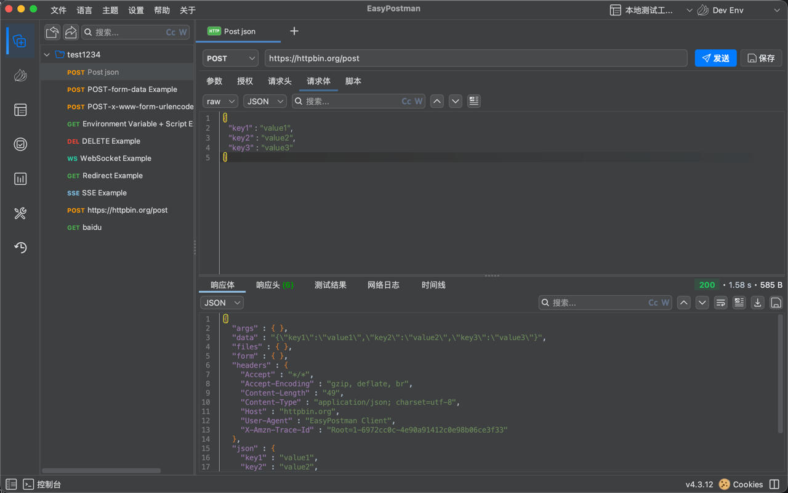
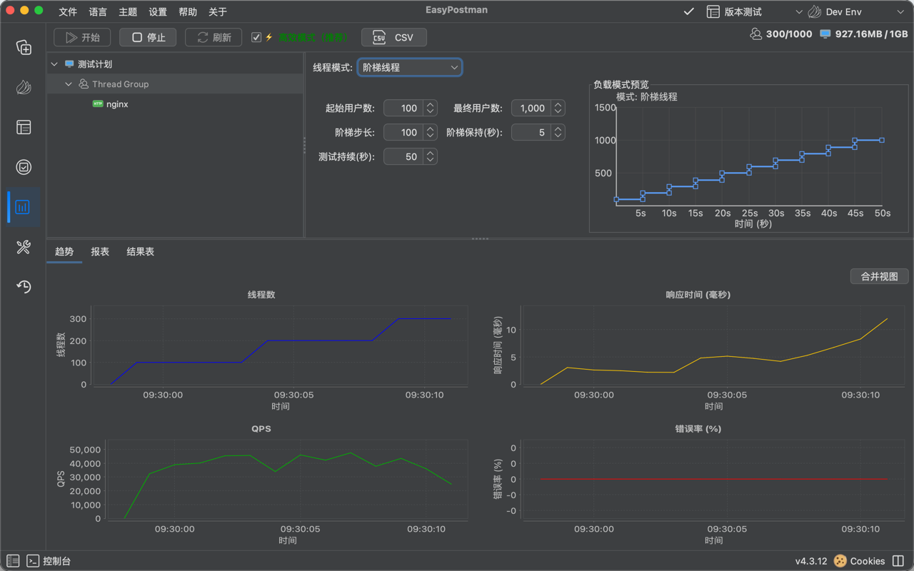
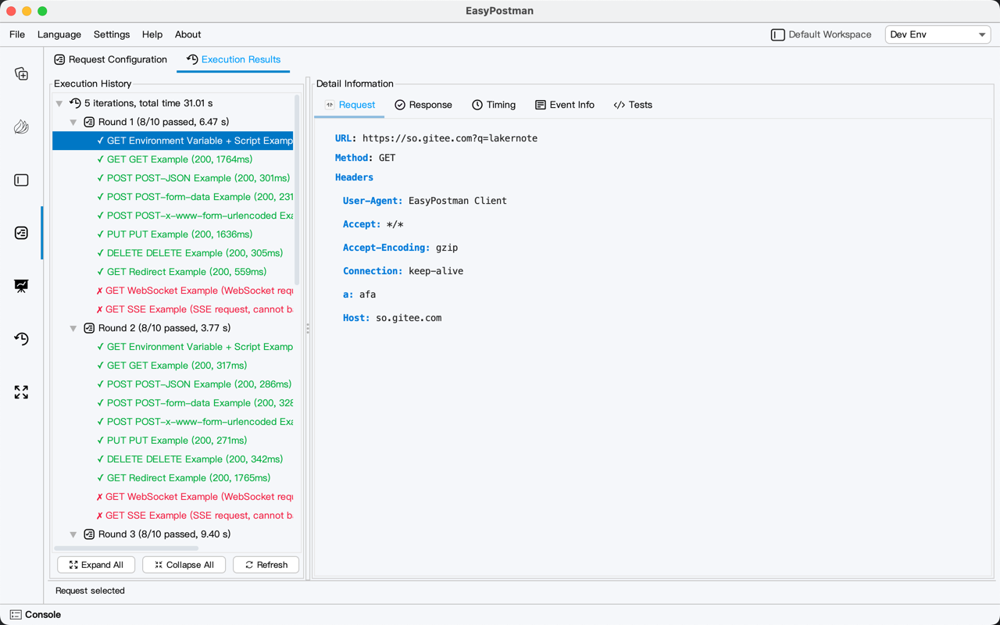

# 🖼️ 截图展示

## 应用图标 & 欢迎界面

|                                 图标                                  |                                  欢迎界面                                   |
|:---------------------------------------------------------------------:|:-------------------------------------------------------------------------:|
|                                                    |                                                |

## 主界面

### 主页 & 工作区
|          主页          |                                  工作区管理                                   |
|:--------------------:|:-------------------------------------------------------------------------:|
|  |                                          |

### 接口集合管理
|                                 接口集合                                  |                                  导入集合                                   |
|:------------------------------------------------------------------------:|:--------------------------------------------------------------------------:|
|                                      |                          |

### 暗色模式
|                                 暗色集合界面                                  |                                  暗色性能趋势图                                   |
|:----------------------------------------------------------------------------:|:-------------------------------------------------------------------------------:|
|                        |                    |

## 环境变量 & 功能测试

### 环境变量
|                                 环境变量配置                                  |
|:----------------------------------------------------------------------------:|
|                                    |

### 功能测试
|                                 功能测试                                  |                                  功能测试 1                                   |                                  功能测试 2                                   |
|:------------------------------------------------------------------------:|:----------------------------------------------------------------------------:|:----------------------------------------------------------------------------:|
|                                          |                                    |                                    |

|                                 功能测试结果                                  |
|:----------------------------------------------------------------------------:|
|                                |

## 历史记录 & 网络监控

### 请求历史
|                                 历史记录                                  |                                  历史时间线                                   |                                  历史事件                                   |
|:------------------------------------------------------------------------:|:----------------------------------------------------------------------------:|:--------------------------------------------------------------------------:|
|                                              |                              |                                |

### 网络日志
|                                 网络日志                                  |
|:------------------------------------------------------------------------:|
|                                          |

## 性能测试

### 主界面
|                                 性能测试                                  |
|:------------------------------------------------------------------------:|
|                                      |

### 报告 & 分析
|                                 性能报告                                  |                                  性能结果树                                   |                                  性能趋势图                                   |
|:------------------------------------------------------------------------:|:----------------------------------------------------------------------------:|:----------------------------------------------------------------------------:|
|                          |                |                            |

### 线程组模式
|                                 固定线程                                  |                                  递增线程                                   |
|:------------------------------------------------------------------------:|:--------------------------------------------------------------------------:|
|  |  |

|                                 尖刺线程                                  |                                  阶梯线程                                   |
|:------------------------------------------------------------------------:|:--------------------------------------------------------------------------:|
|  |  |

## 脚本支持

### 请求前脚本 & 测试脚本
|                                 请求前脚本                                  |                                  测试脚本                                   |
|:--------------------------------------------------------------------------:|:--------------------------------------------------------------------------:|
|                                        |                                        |

### 代码片段
|                                 代码片段库                                  |
|:--------------------------------------------------------------------------:|
|                              |

## Git 集成

### Git 提交
|                                 Git 工作区提交                                  |
|:------------------------------------------------------------------------------:|
|                      |
