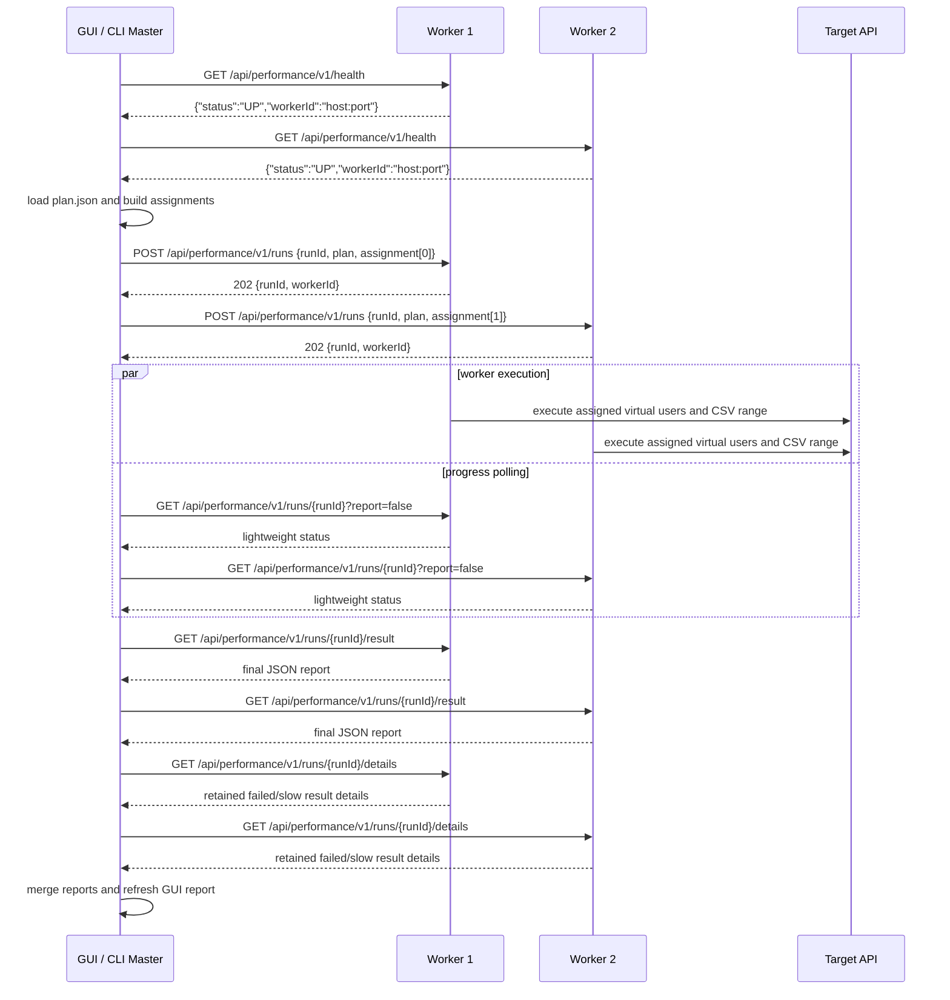

# 性能压测模块设计

本文档说明 `com.laker.postman.panel.performance` 下压测功能的当前设计边界，重点覆盖 UI、执行模型、线程组模型、指标采样和结果刷新。

## 设计目标

- `PerformancePanel` 只负责组装 Swing 视图、绑定事件和协调生命周期，不承载压测执行细节。
- 压测执行和 UI 刷新解耦：请求执行在线程组 worker 中完成，统计快照在专用后台线程中生成，Swing 组件只在 EDT 更新。
- 线程模型集中管理：所有性能压测后台线程通过统一工厂命名和设置 daemon，便于调试、关闭和日志排查。
- 指标数据增量采样：总报表使用累计统计，趋势图使用采样窗口统计，WebSocket/SSE 长连接使用实时计数补充窗口内没有完成样本的情况。
- 高并发结果显示保持有界：结果表通过队列和 Swing Timer 分批刷新，避免每个请求都直接触发 EDT 更新。
- GUI、headless CLI 和 worker 使用同一份运行态 `plan.json`。`collections.json`、`environments.json`、`performance_config.json` 是编辑态工作区文件；`plan.json` 是可执行语义快照，包含环境、全局变量、执行设置、执行计划和外部 asset 引用。

## 多计划设计结论

当前 GUI 编辑态保持“一个工作区一个活跃压测计划”。左侧根节点“测试计划”下面可以配置多个 Thread Group，但它们属于同一个 plan；勾选启用的 Thread Group 会在同一次 Start 中一起执行。

暂不把 GUI 做成多个顶层 plan 同时启用，原因是多 plan 会引入新的运行编排语义：不同 plan 的线程组、CSV 分片、报表汇总、结果表明细、Stop All、worker assignment 都需要按 plan 维度隔离。如果直接允许多个 plan 同时跑，会让一次 report 同时混入多个测试目标，后续定位和对比都不清晰。

后续如要支持多 plan，推荐按以下设计推进：

1. 编辑态存储从单 root 迁移为 `plans[] + activePlanId`。每个 plan 保存自己的 tree、efficientMode、trendEnabled、reportRealtimeEnabled、remote worker 配置；旧 `performance_config.json` 迁移时包成一个默认 plan。
2. GUI 左侧增加 plan 选择器或 plan 列表，提供新建、复制、重命名、删除、导入、导出。编辑区始终只编辑一个 active plan。
3. 单次点击 Start 只执行当前选中的 active plan。批量执行多个 plan 应作为独立的“批量编排/套件”能力，串行或并行策略需要显式配置。
4. `plan.json` 仍表示一个可执行 plan，不改成一次包含多个 plan。CLI/master/worker 继续以一个 plan 为最小执行单位；批量编排层负责按多个 `plan.json` 发起多次 run。
5. 报表、趋势、结果明细都以 runId + planId 隔离。只有批量编排层可以做跨 plan 的对比摘要，不在单次压测 report 中混合。

## 主要组件

### UI 编排

- `PerformancePanel`：模块入口，创建树、属性面板、结果页、执行引擎、统计协调器和定时器。
- `PerformancePanelViewFactory`：集中创建 Swing 组件，降低 `PerformancePanel` 的 UI 构建代码量。
- 顶部工具栏支持 `Remote` 模式和 worker 列表配置。开启后 GUI 的 Start/Stop 不再本机执行，而是按 JMeter Remote Start/Stop All 的语义控制所有配置的 worker；顶部虚拟用户数、趋势开关和报表刷新方式与本机执行保持同一套语义。
- `PerformanceTreeSupport` / `PerformanceTreeInteractionSupport`：管理树节点结构、右键菜单、节点选择和请求结构同步。
- `PerformancePropertyPanelSupport`：保存当前属性面板数据，屏蔽线程组、断言、定时器、SSE、WebSocket 配置面板的细节。
- `PerformanceRunControlSupport`：处理启动、停止、按钮状态、最终 flush 和完成通知。
- `PerformanceRemoteRunControlSupport`：GUI 远程执行控制器，负责生成运行态 `plan`、向 worker 分发 assignment、轮询状态、Stop All 和把 master 聚合报表写回 GUI 报表页。

### 执行模型

- `PerformanceTestPlanCompiler`：将执行快照从 Swing `DefaultMutableTreeNode` 编译成不可变的性能执行计划。计划由 `PerformanceTestPlan`、`PerformanceThreadGroupPlan`、`PerformanceLoopController`、`PerformanceTimerElement`、`PerformanceRequestSampler`、断言元素和协议阶段元素组成。
- `com.laker.postman.panel.performance.plan`：只保存执行所需的不可变 plan 数据。除编译器负责读取 Swing tree 外，plan 元素不再提供反向重建 Swing tree 的 API。
- `easy-postman-performance-core` 的 `PerformanceRunPlan`：运行态 envelope，保存 `environment`、`globals`、`settings`、`testPlan`、`assets`。它不保存 Swing tree 或 `HttpRequestItem`，而是保存跨 GUI/CLI/worker 可消费的请求快照；`settings` 只放执行语义，例如 efficientMode 和 HTTP runtime 并发参数，不放趋势开关、实时报表刷新等 GUI 展示状态。
- `PerformanceRunPlanFactory`：GUI 导出 `plan.json` 时将当前压测配置、活动环境、全局变量和 asset 引用冻结成运行态计划。
- `com.laker.postman.performance.runtime.PerformanceRunPlanExecutor`：headless CLI 和 worker 共用的 app 侧运行适配器，加载 `plan.json`，将 core plan 编译后通过 `PerformanceCorePlanAdapter.toGuiExecutablePlan(...)` 转成 app 现有执行链可消费的 plan，并复用 `PerformanceExecutionEngine` 执行。CLI 包只负责参数解析和结果输出。
- `PerformanceExecutionEngine`：执行门面，负责运行生命周期、实时指标、网络取消资源和树到 plan 的入口转换。它不再直接遍历 Swing tree。
- `PerformanceThreadGroupRunner`：执行启用的线程组，并根据 FIXED、RAMP_UP、SPIKE、STAIRS 调度虚拟用户 worker。
- `PerformancePlanExecutor`：执行线程组内的控制器模型，按顺序处理 Loop、Timer 和 Request Sampler。
- `PerformanceSamplerExecutor`：把 request sampler 交给 `PerformanceRequestExecutor`，并通过 `PerformanceResultRecorder` 记录结果。执行层直接消费 plan model，request 级别不再保留 tree-based 执行入口。
- `PerformanceIterationContextFactory`：为每次虚拟用户迭代创建 `ExecutionVariableContext`，设置迭代编号，并按当前 `PerformanceThreadGroupPlan` 的 CSV Data Set 和线程组内虚拟用户编号绑定 CSV 行。
- `PerformanceThreadGroupPlanner`：基于编译后的 plan 计算线程数和预估请求量。旧的 tree-based 方法保留，但内部会先编译 plan。
- `PerformanceVirtualUserCoordinator`：维护虚拟用户上下文，包括 active user 数、虚拟用户编号、当前迭代编号和进度回调。

### Headless CLI 与 Worker 边界

- 单机 headless 使用主 app jar，不单独发布 CLI jar：`java -jar easy-postman.jar performance run --plan plan.json [--out result.json]`。
- `App.main(args)` 先经 `AppCommandRouter` 判断命令行模式；命中 `performance run`、`performance worker` 或 `performance master run` 时自动设置 `java.awt.headless=true`，并且不进入 Swing EDT。
- `performance run` 和 `performance worker` 初始化 IOC、宿主插件桥接服务和插件运行时，不创建 `MainFrame`、主题、字体或 Splash；`performance master run` 当前只读取 plan、生成 assignment 并通过 HTTP 调度 worker。
- headless 命令默认保留控制台 INFO 日志，方便在服务器上直接排查插件扫描、脚本池、workspace 加载等问题；如需临时收敛输出，可手动加 `-DCONSOLE_LOG_LEVEL=ERROR`。
- CLI 运行期间通过 `RunScopedVariableContext` 注入 `plan.json` 内的 environment/globals；请求最终发送前的 `{{var}}` 替换、脚本 `pm.environment` / `pm.globals` 和子线程变量解析都走同一份运行态变量，不写回用户持久化全局变量文件。
- CLI 输出的 `result.json` 包含顶层摘要和 `report` 节点。`report` 保存机器可读的原始数值：总请求数、成功/失败数、协议级 total、API 级 total、samplesPerSecond、HTTP 字节吞吐、耗时分位数，以及 WebSocket/SSE 的消息数、消息速率和首消息/首事件延迟。
- worker 使用主 app jar 内的 JDK `HttpServer`，不引入 Jetty/Netty/Spring Boot。server 只在 `performance worker` 模式启动，GUI 默认不监听端口。
- worker 控制台输出用户可读的生命周期和进度状态：listening、accepted、started、progress、completed。进度默认每秒打印一次，可通过 `--progress-interval <seconds>` 调整，或用 `--no-progress` 关闭；请求级和内部组件日志仍按日志配置输出。
- worker 控制面协议为 HTTP/JSON：`GET /api/performance/v1/health`、`POST /api/performance/v1/runs`、`GET /api/performance/v1/runs/{runId}`、`GET /api/performance/v1/runs/{runId}/result`、`GET /api/performance/v1/runs/{runId}/details`、`POST /api/performance/v1/runs/{runId}/stop`。
- master 使用 JDK `HttpClient` 调度 worker：`performance master run --plan plan.json --workers host:port[,host:port] [--out result.json]`。master 读取同一份 `plan.json`，生成 `PerformanceWorkerAssignment`，将 plan + assignment 发送给各 worker，轮询状态后拉取 worker report 并聚合。
- GUI 远程模式复用同一套 HTTP/JSON worker 协议和 assignment planner。GUI 配置的虚拟用户数是全局总并发，master 会按 worker 数切成连续虚拟用户区间；例如 100 用户、2 个 worker 时分别执行 0-49 和 50-99，而不是每台 worker 各跑 100。
- GUI 不上传 `assets.zip`；GUI 导入或手工创建的 CSV 行会内嵌进 `plan`，file-source CSV 和 multipart 文件引用会进入 `plan.assets` 并保持原路径，用户需要按这些路径把文件提前放到每台 worker 服务器上。CSV Data Set 按同一全局虚拟用户区间取行，因此 100 行 CSV 搭配 100 用户、2 个 worker 时也是 0-49 和 50-99 两段；如果 CSV 行数少于虚拟用户数，仍按全局用户编号循环复用。
- worker 必须接收 master/GUI 生成的 assignment 才会执行，避免误把同一份完整 `plan` 在多台 worker 上各跑一遍导致总并发被放大。
- `performance-core.worker` 保存无 UI 的 assignment/protocol DTO、assignment planner 和 worker execution plan partitioner；`performance.worker` / `performance.master` 保存 app 侧 server/client/命令实现。后续要做认证、心跳、资产 bundle、精确全局分位数聚合时，仍按这个边界扩展。

### Headless CLI 验证脚本

从 GUI 导出 `plan.json` 后，headless 单机验证使用主 app jar：

```bash
mvn -q -pl easy-postman-app -am -DskipTests package
java -jar easy-postman-app/target/easy-postman-5.5.28.jar \
  performance run \
  --plan "$HOME/Downloads/plan.json" \
  --out /tmp/easy-postman-headless-result.json
jq . /tmp/easy-postman-headless-result.json
```

macOS 本机如果需要给压测命令加最长运行时间保护，可以用 `perl` 的 alarm 包一层：

```bash
perl -e 'alarm shift; exec @ARGV' 90 \
  java -jar easy-postman-app/target/easy-postman-5.5.28.jar \
  performance run \
  --plan "$HOME/Downloads/plan.json" \
  --out /tmp/easy-postman-headless-result.json
```

本地验证记录：使用 GUI 导出的 `$HOME/Downloads/plan.json`，线程组为固定 20 线程、按时间运行 60 秒，CLI 成功完成并写出结果。下面是 `result.json` 节选，字段名与真实输出一致：

```json
{
  "status": "SUCCESS",
  "totalRequests": 858211,
  "successRequests": 858211,
  "failedRequests": 0,
  "stopped": false,
  "elapsedTimeMs": 60084,
  "report": {
    "schemaVersion": "1.1",
    "source": "local",
    "status": "SUCCESS",
    "summary": {
      "totalRequests": 858211,
      "successRequests": 858211,
      "failedRequests": 0
    },
    "protocols": {
      "HTTP": {
        "total": {
          "samplesPerSecond": 14283.1,
          "firstSampleStartTimeMs": 1764356811000,
          "lastSampleEndTimeMs": 1764356871084,
          "bytes": {
            "sentBytes": 0,
            "receivedBytes": 0,
            "sentBytesPerSecond": 0.0,
            "receivedBytesPerSecond": 0.0,
            "avgReceivedBytes": 0
          },
          "durationMs": {
            "avg": 0,
            "min": 0,
            "max": 0,
            "p90": 0,
            "p95": 0,
            "p99": 0
          }
        },
        "apis": []
      }
    }
  }
}
```

### Master / Worker 本机验证脚本

先启动两个 worker 进程：

```bash
java -jar easy-postman-app/target/easy-postman-5.5.28.jar \
  performance worker \
  --host 127.0.0.1 \
  --port 19090

java -jar easy-postman-app/target/easy-postman-5.5.28.jar \
  performance worker \
  --host 127.0.0.1 \
  --port 19091
```

再由 master 分发同一份 `plan.json`：

```bash
java -jar easy-postman-app/target/easy-postman-5.5.28.jar \
  performance master run \
  --plan "$HOME/Downloads/plan.json" \
  --workers 127.0.0.1:19090,127.0.0.1:19091 \
  --out /tmp/easy-postman-master-result.json
jq . /tmp/easy-postman-master-result.json
```

本地验证记录：同一份 `$HOME/Downloads/plan.json` 通过两个本机 worker 分片执行，master 成功聚合。下面是 `master-result.json` 节选：

```json
{
  "schemaVersion": "1.1",
  "status": "SUCCESS",
  "source": "master",
  "summary": {
    "totalRequests": 981956,
    "successRequests": 981956,
    "failedRequests": 0,
    "successRate": 100.0
  },
  "protocols": {
    "HTTP": {
      "total": {
        "total": 981956,
        "successRate": 100.0,
        "samplesPerSecond": 16345.2,
        "bytes": {
          "sentBytes": 0,
          "receivedBytes": 0,
          "sentBytesPerSecond": 0.0,
          "receivedBytesPerSecond": 0.0,
          "avgReceivedBytes": 0
        }
      }
    }
  }
}
```

打包脚本的 `jlink --add-modules` 已包含 `jdk.httpserver`，否则 jpackage 后的 worker 模式会因为精简运行时缺少 `com.sun.net.httpserver.HttpServer` 而启动失败。

### Master / Worker 时序与协议

Master / worker 使用 JDK `HttpClient` + JDK `HttpServer`，控制面是 HTTP/JSON，数据面仍由各 worker 本机执行 OkHttp 请求。GUI 远程模式和 CLI master 使用同一套协议。



协议端点：

| Method | Path | 用途 | 时间口径 |
|---|---|---|---|
| `GET` | `/api/performance/v1/health` | 探活，返回 worker id、host、port。 | 不计入压测时间。 |
| `POST` | `/api/performance/v1/runs` | 提交一次运行，body 包含完整 `plan` 和该 worker 的 `assignment`。 | plan 上传、JSON 解析和 assignment 校验不计入最终 report 的执行时间。 |
| `GET` | `/api/performance/v1/runs/{runId}?report=false` | 轻量状态轮询，只返回 users、requests、QPS、状态，不构建完整 report。 | 不改变最终 report 时间；GUI 趋势按轮询间隔计算窗口 QPS。 |
| `GET` | `/api/performance/v1/runs/{runId}` | 完整状态轮询，返回运行中 report。GUI 远程模式每 1 秒轮询一次，但只有开启“实时报表”时才调用完整 report。 | 只在需要实时报表时使用，开销高于轻量状态。 |
| `POST` | `/api/performance/v1/runs/{runId}/stop` | 请求 worker 停止当前运行。 | 停止控制面不计入成功请求数。 |
| `GET` | `/api/performance/v1/runs/{runId}/result` | 拉取 worker 最终 JSON report。 | 最终 report 已固定，不再重新采样。 |
| `GET` | `/api/performance/v1/runs/{runId}/details` | 拉取 worker 有界保留的失败/慢请求明细，用于 GUI 结果表。 | 明细拉取发生在收尾阶段，不计入成功请求数。 |

时间口径：

1. `plan.json` 通过 `POST /runs` 发送到 worker，这属于控制面分发，不计入最终 report 的 `elapsedTimeMs` 和报表 QPS。
2. worker 控制台的 `completed run ... elapsedMs` 从 worker 异步开始执行算起，包含 worker 侧 plan 编译、分片应用、脚本池启动和实际请求执行，不包含 HTTP body 上传时间。
3. 最终 JSON report 的 `metadata.startTimeMs/endTimeMs` 来自 worker 内部 `PerformanceRunSession`，从执行引擎 `beginRun` 开始，到运行结束为止；不包含 master 读 plan、生成 assignment、POST plan 和最终拉取 result 的时间。
4. GUI 远程模式固定每 1 秒轮询 worker 状态；趋势图按 worker status 的增量请求数采样。采样窗口在所有 worker 接收 plan 后重置，避免第一秒趋势点把 plan 分发耗时算进 QPS。
5. CLI master 默认每 500ms 使用 `report=false` 轻量轮询，可通过 `--poll-interval-ms <ms>` 调整；GUI remote 只有在“实时报表”开启时才请求运行中完整 report。关闭实时报表时，趋势和顶部虚拟用户数仍实时刷新。
6. GUI remote 在 worker 到达终态后拉取 `/details`，把失败/慢请求明细写入“结果表”；worker 不实时推送请求级明细，避免拖慢压测主路径。

### GUI 远程控制方式

1. 在每台压测机上启动 worker：`java -jar easy-postman.jar performance worker --host 0.0.0.0 --port 19090`。worker 默认每秒打印一次 `users/requests/QPS` 进度，可用 `--progress-interval <seconds>` 调整或 `--no-progress` 关闭。
2. GUI 导入或手工创建的 CSV 行已包含在 `plan.json` 内；如果压测计划引用 file-source CSV 或 multipart 文件，按 `plan.assets` 中的路径把文件放到每台 worker 的相同路径。
3. 在 GUI 顶部工具栏勾选 `Remote`，在 `Workers` 输入框中填写 `host:port` 列表，支持逗号或空白分隔，例如 `10.0.0.11:19090,10.0.0.12:19090`。
4. 点击 `Start` 后 GUI 作为 master 分发当前计划；点击 `Stop` 后向所有 worker 发送 `/stop`。顶部状态仍显示“活跃虚拟用户/总虚拟用户”，`启用趋势` 和 `报表更新方式` 与本机执行使用相同开关。运行中如果关闭实时报表，GUI 只向 worker 拉取轻量状态，不构建完整 report；运行结束后 GUI 报表页展示 master 聚合后的 JSON report 数据。
5. 分布式并发采用总量分摊：GUI 配置 100 个虚拟用户、2 个 worker 时，每台 worker 默认约 50 个；101 个虚拟用户、2 个 worker 时按 51/50 分配。CSV 行跟随虚拟用户全局区间分配，避免不同 worker 同时从第 0 行开始读取。

## 线程模型

### 线程类型

- `PerformanceRun-*`：一次压测运行的顶层后台线程，由 `PerformanceRunControlSupport` 创建。
- `PerformanceThreadGroup-*`：根节点下每个启用线程组的调度入口。
- `PerformanceFixedWorker-*`：固定线程模式 worker。
- `PerformanceRampScheduler-*` / `PerformanceRampWorker-*`：递增模式的调度线程和 worker。
- `PerformanceSpikeScheduler-*` / `PerformanceSpikeWorker-*`：尖刺模式的调度线程和 worker。
- `PerformanceStairsScheduler-*` / `PerformanceStairsWorker-*`：阶梯模式的调度线程和 worker。
- `PerformanceTimer-*`：趋势图采样和报表刷新定时触发器。
- `PerformanceMetrics-*`：统计快照和趋势窗口计算线程。
- `PerformanceStopFlush-*`：停止压测后的最终 UI flush 协调线程。

所有这些线程都通过 `PerformanceThreadFactory` 创建，统一设置线程名、daemon 属性和未捕获异常日志。

### 停止语义

停止压测时按以下顺序处理：

1. 将 running 状态置为 false，并 interrupt 顶层运行线程。
2. 取消 OkHttp 请求、SSE EventSource 和 WebSocket。
3. 停止采样/刷新定时器。
4. 异步等待短暂统计收敛，然后在 EDT 上 flush 结果表、采样最后一次趋势数据、刷新报表。
5. 恢复 OkHttp 默认连接池和 dispatcher 配置。

`PerformanceTimerManager.stopAll()` 在非 EDT 调用时会等待 scheduler 关闭；如果从 EDT 调用，只取消任务并关闭 scheduler，不等待 termination，避免停止按钮卡住界面。

## 指标模型

### 累计统计

`PerformanceStatsCollector` 使用同步方法维护累计统计：

- 按协议和 API 聚合请求数、成功数、失败数。
- 使用直方图计算耗时分位数，避免保存所有请求耗时。
- HTTP 记录请求头 + 请求体发送字节、响应头 + 响应体接收字节，并派生 Sent KB/s、Received KB/s 和 Avg Bytes。
- WebSocket/SSE 额外记录消息数、匹配数、首消息延迟和主要完成原因。

`snapshot()` 生成报表快照，不保留单请求结果。

### HTTP 指标口径

- 请求耗时：只统计 sampler/request 的网络请求耗时，从请求开始到最后响应数据收到后结束；不包含前置脚本、后置脚本、断言、结果表渲染和 master/worker 控制面耗时。
- QPS：`total / ((lastSampleEndTimeMs - firstSampleStartTimeMs) / 1000)`。单机和单 worker 使用本机样本窗口；master 合并多个 worker 时使用所有 worker 的全局最早样本开始时间和最晚样本结束时间重算，避免简单相加 worker QPS 带来的误差。
- Sent KB/s：`sentBytes / sampleWindow / 1024`，sentBytes 为请求头 + 请求体字节数。
- Received KB/s：`receivedBytes / sampleWindow / 1024`，receivedBytes 为响应头 + 响应体字节数。
- Avg Bytes：`receivedBytes / total`，按每个 HTTP sample 的平均接收字节数展示，对齐 JMeter Aggregate Report 的 Avg. Bytes 使用习惯。

### 趋势窗口

`sampleTrendSnapshot(...)` 读取当前窗口内的增量统计，然后重置窗口计数。HTTP 的 QPS、失败率和耗时来自已完成请求；WebSocket/SSE 的实时消息速率、首消息延迟和活跃会话时长来自 `PerformanceRealtimeMetrics`，用于补齐长连接运行中尚未结束的样本。

### UI 刷新

`PerformanceStatisticsCoordinator` 负责连接统计数据和 UI：

- `refreshReport()` 先切到 EDT 检查当前是否在报表 Tab，未查看时报表刷新直接跳过。
- 报表快照和趋势窗口计算提交到单线程 `PerformanceMetrics-*`，串行执行，避免占用 common pool。
- 所有 Swing 组件更新通过 `SwingUtilities.invokeLater` 回到 EDT。

## 结果表刷新

`PerformanceResultTablePanel` 不直接在请求线程更新表格：

- 请求线程只把 `ResultNodeInfo` 放入 `pendingQueue`。
- Swing Timer 每 200ms 在 EDT 上批量拉取最多 2000 条结果并追加到 TableModel。
- 停止或完成时调用 `flushPendingResults()`，确保队列中的结果最终显示。
- 搜索使用 300ms 防抖，避免每次输入都对大结果集做过滤。

## 扩展新线程模式

新增线程组模式时建议按以下步骤处理：

1. 在 `ThreadGroupData.ThreadMode` 中增加模式及配置字段，并在 `normalize()` 中定义边界。
2. 在 `ThreadGroupPropertyPanel` 中增加配置 UI 和预览数据。
3. 在 `PerformanceThreadGroupPlanner` 中增加最大线程数和请求量估算。
4. 在 `PerformanceThreadGroupRunner` 中增加调度方法，worker 生命周期交给 `PerformanceVirtualUserCoordinator`。
5. 增加针对估算、调度边界、停止语义的单元测试。

## 维护原则

- Swing 组件只在 EDT 读写。
- 压测执行只能消费 `PerformanceTestPlanCompiler` 生成的执行计划，不直接依赖可变 UI 树。
- 执行线程不直接操作 UI，只通过进度回调、结果队列和统计协调器传递状态。
- 线程创建不要直接 `new Thread(...)`，使用 `PerformanceThreadFactory`。
- 指标计算不要使用 `CompletableFuture.runAsync(...)` 默认线程池，使用模块内专用执行器。
- 高并发路径不保存不必要的明细对象；需要展示明细时由高效模式控制保留范围。
